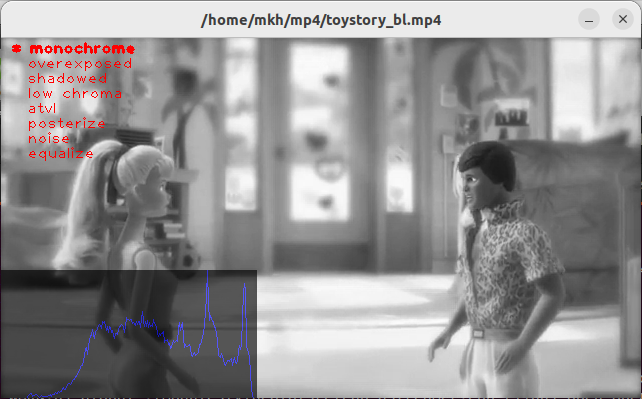
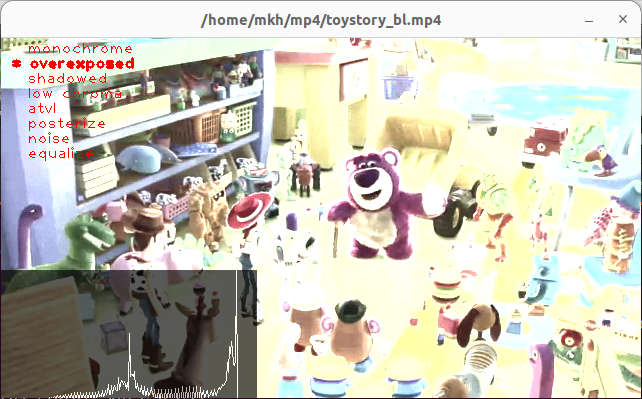
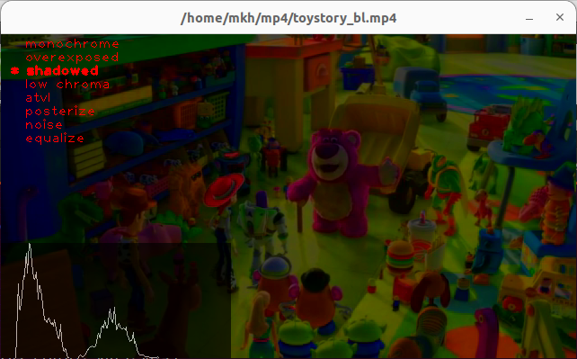
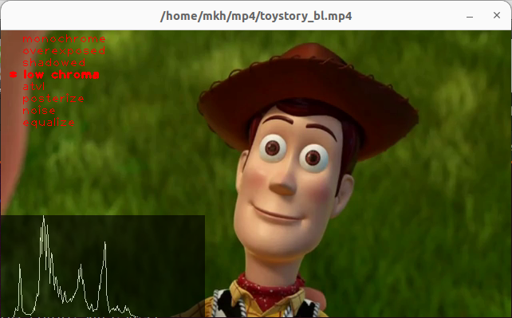
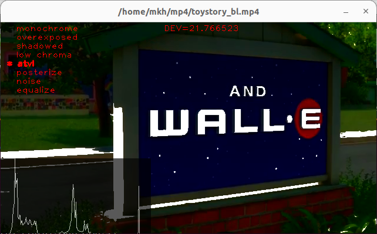
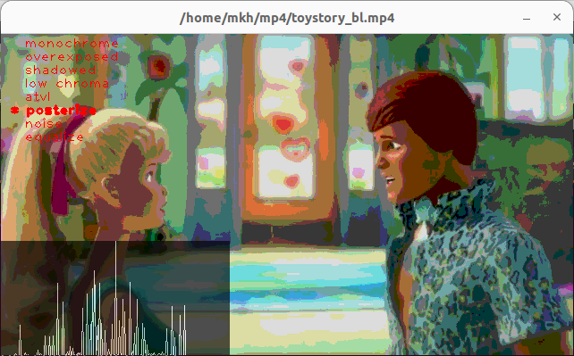
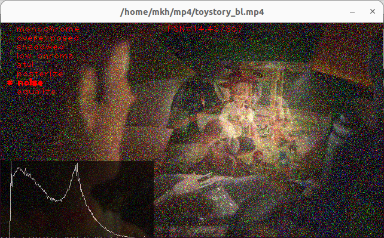
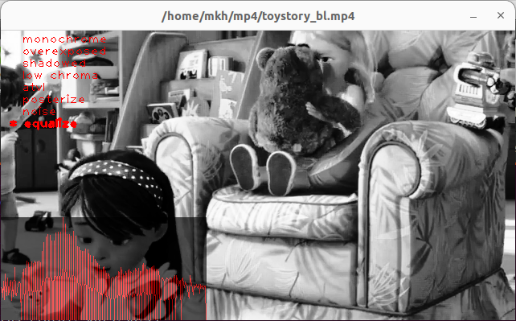

# Симулятор дефектов видеопотока с камеры

**Сборка**

`git clone https://github.com/m-khomutov/video-defects.git`  
`cd video-defects`  
`mkdir build`  
`cmake ..`  
`make all`  

**Параметры запуска (выводятся опцией -h)**

```
$ ./videodefects -h

Запуск: ./videodefects[-s] [-c] [-v] [-h]

	-f	файл на воспроизведение
	-c	камера на воспроизведение (int)
	-v	вывод клавиш управления
	-h	вывод параметров запуска
```


**Остановка программы**

Программа выгружается через комбинацилю клавиш Ctrl+C.  
Стандартный механизм закрытия окна (через крестик) выключен.  

**Вывод клавиш управления(выводятся опцией -v)**

```
$ ./videodefects -v

Клавиши управления ./videodefects: y, u, v, r, g, b, left, right, up, down, enter (повторное нажатие - отмена управления)

Клавиши управления выводом гистограммы:
	y	YUV схема. Вывод яркости Y
	u	YUV схема. Вывод цветности U (Cb)
	v	YUV схема. Вывод цветности V (Cr)
	r	RGB схема. Вывод "красной" части гистограммы
	g	RGB схема. Вывод "зеленой" части гистограммы
	b	RGB схема. Вывод "синей" части гистограммы
Тесты (перемещение, запуск остановка):
	up	выбор теста выше по списку (выбранный тест выделяется)
	down	выбор теста ниже по списку (выбранный тест выделяется)
	enter	запуск/остановка теста (запущенный тест маркируется *)
	left	уменьшение значения параметра теста (у каждого теста свой параметр)
	right	увеличение значения параметра теста (у каждого теста свой параметр)

```

**Воспроизводимые дефекты**

* monochrome - полное отсутствие цвета
  
* overexposed - избыточная яркость  
  
* shadowed - недостаточная яркость  
  
* low chroma - недостаточный уровень цветность  
  
* atvl - недостаточная четкость (по аналогии с Alternating Television Verticl Lines)  
  
* posterize - постеризация (ограничение цветовой палитры)  
  
* noise - высокая зашумленность  
  
* equalize - выравнивание гистограммы  
  

**Протокол выдачи видеоданных**

На tcp порт 5555 принимается стандартный rtsp-диалог. Видеопоток отдается в формате rtp.  

